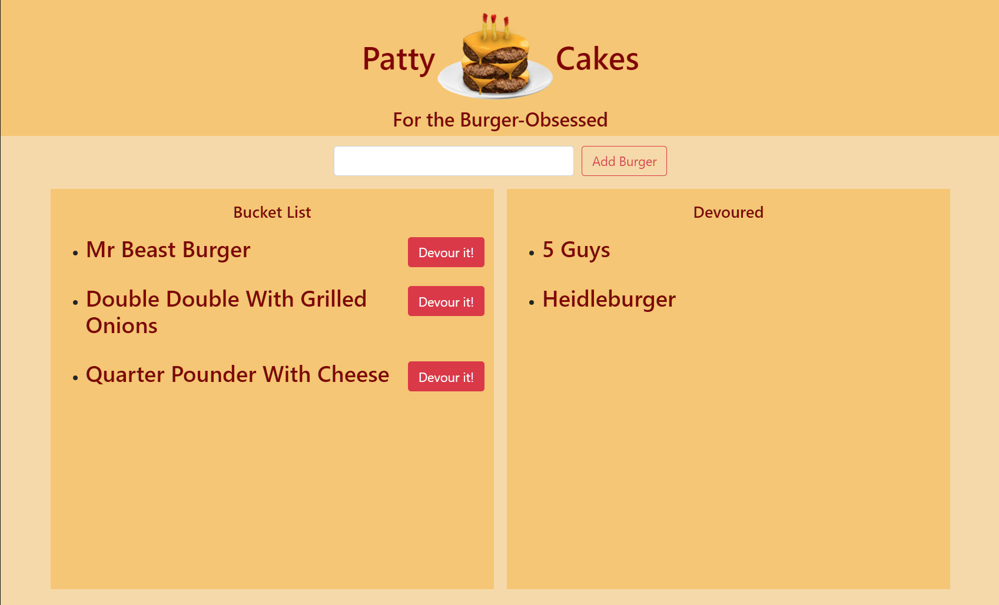

# Patty Cakes <!-- omit in toc -->
--- 
### Table of Contents

- [Live Site](#live-site)
- [Description](#description)
- [Installation](#installation)
- [How to use it](#how-to-use-it)
- [Future Development](#future-development)
  - [Credits](#credits)
  - [How to contribute](#how-to-contribute)
  - [Tests](#tests)
  - [License](#license)
  - [Questions](#questions)

## Live Site
[View Now](https://thawing-bayou-75201.herokuapp.com/)

## Description
With burgers, it's about the journey, not the destination.

___Technologies Used___
- mysql
- express
- handlebars

___Motivation___
With burgers, it's about the journey, not the destination.

## Installation
Project is deployed at the link above.

## How to use it
Use the add burger field to add burgers you want to devour. Track your progress with the Devour It! Buttons.

## Future Development
Ability to delete burgers. List scrolling. Burger suggestions.

### Credits
Developers: C.T. Bell
### How to contribute
Email me

### Tests
No tests provided

### License
#####MIT
[Link to MIT licence](https://opensource.org/licenses/MIT)

### Questions
If you have a question about this software, contact the developer at:
charlestbell@gmail.com

Home Page
